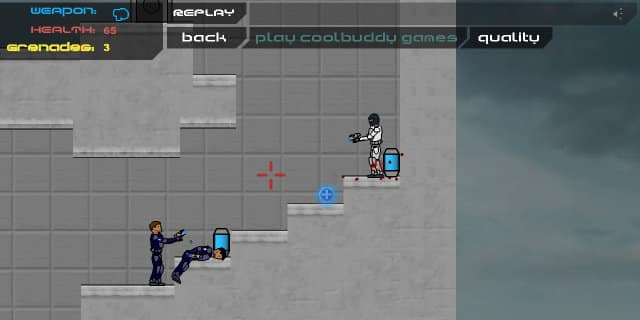
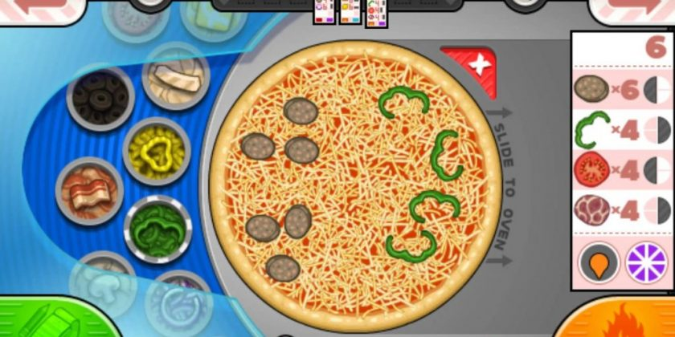

# 1
#### Útskýrðu muninn á 2d og 3d leikjagerð í Unity?

Munurinn á 2D umhverfi og 3D er helst það hvaða hluti þú notar í leikinn þinn og hvernig myndavélin er sett upp. Í stuttu máli er 2D umhverfi bara með 2 ása (Dimensions) en 3D með 3. Þessvegna er allt flatt í 2D umhverfi.

**Myndavélin:** Þegar þú ert að búa til 2D leik þá stilliru myndavérlina á Orthographic stillinguna sem gerið það að verkum að þú munt ekki sjá mun á einhvernumh hlut því lengra sem hann er í burtu frá þér og allt virðist vera flatt eða 2D. Á móti þegar þú ert að gera 3D leik þá geturu séð hversu langt frá einhver hlutur er og umhverfið er ekki flatt.

**Sprites VS Meshes:** 2D leikir nota sprites með SpriteRenderer Component sem eru flatar myndir af einhverjum hlut sem að er í leiknum sem unity birtir á skjáinn. En 3D leikir nota MeshRenderer component til að birta modelin af hlutunum sem eru gerð úr þúsundum þríhyrninga.

**Physics2D VS Physics3D:** Unity notar öðruvísi physics stillingar fyrir 2D hluti og 3D, t.d. þá er til Rigidbody3D og Rigidbody2D.

# 2
#### Berðu saman og tilgreindu amk. 3 mismunandi tegundir af 2d tölvuleikjum

**Undertale:** Undertale er leikur þar sem að þú ferð í gegnum heiminn og talar við persónur í leiknum og berst við óvini í 2D RPG stíl.

**Plazma Burst:** Plazma Burst er side scroller þar sem þú átt að komast á endann og skjóta alla óvinina sem reyna að drepa þig. Það er saga bakvið hann og cutscenes í endanum sem að gerir leikinn skemmtilegan.

**Papa's:** Papa's leikirnir ganga út á það að sjá um veitingastað eða einhverskonar búð sem selur mat. Þú átt að elda matinn og svo færðu stig útfrá því hversu vel maturinn er eldaður.

 

# 3
#### Hvað er og hvenær er heppilegt að nota 2.5d í tölvuleikjagerð?

2D og 3D heita það vegna þess að þau eru með það marga ása, 2D er með 2 og 3D er með 3. Dæmi um 2.5D leik er t.d. Clash of Clans mobile leikurinn. Hann virðist vera 3D en hann er settur saman bara með 2D sprite-um sem virðast vera 3D þegar þú spilar leikinn.

Eitt af því sem þú græðir á því að búa til 2.5D leik er að ef þú notar bara sprites þá er mun léttara að keyra leikinn á tölvum heldur en ef þú værir að nota 3D módel fyrir allt í leiknum sem eru gerð úr mjög mörgum þríhyrningum og er þá erfiðara að rendera það heldur en sprite-in.

# 4
#### Hvers vegna að nota 4d í tölvuleikjagerð? Komdu með dæmi um tölvuleiki í 4d og útskýrðu 4d virkni hans

# 5
#### Búðu til í Unity samsetta e. sprite persónu eða hlut að eigin vali með Sprite Editor

# 6
#### Búðu til leikjahönnunarskjal (e. GDD).
